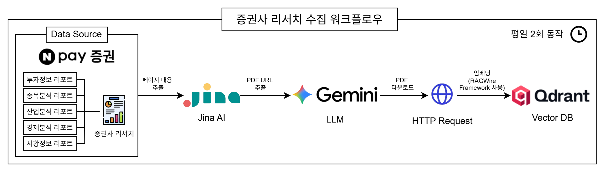
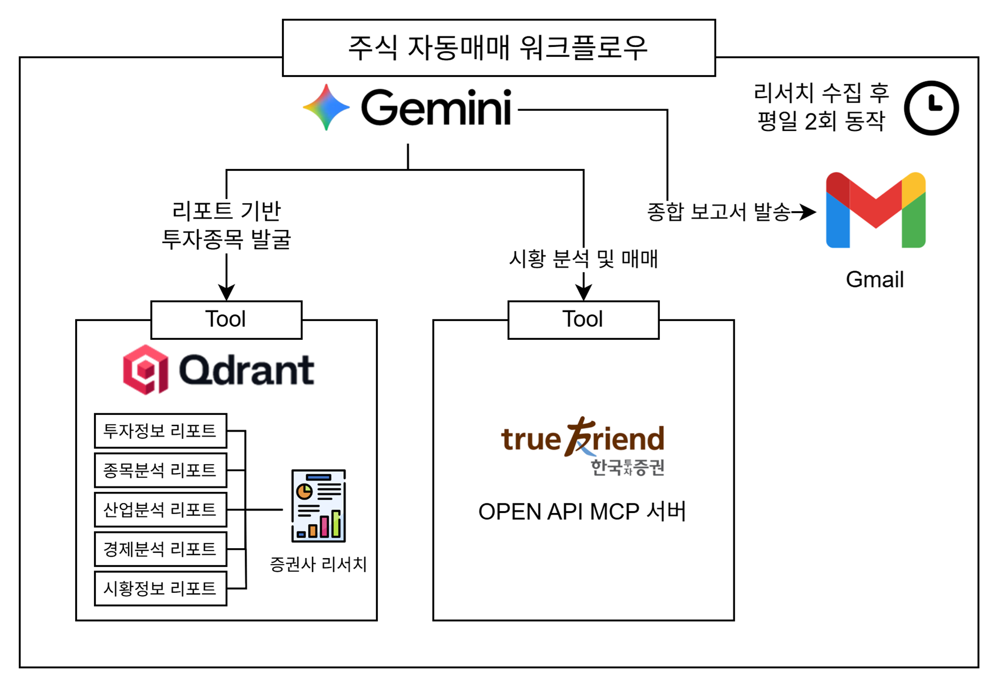

# 📈 KIS MCP AutoTrader


**한국투자증권(KIS) MCP**와 **n8n**을 결합한 AI 기반 주식 자동 매매 시스템입니다.  
네이버페이 증권에 업로드되는 5개 증권사의 리서치를 수집하고, LLM(Gemini)이 한국투자증권 MCP를 통해 실시간 시장 데이터에 접근합니다. 이후 n8n 워크플로우를 통해 자동화된 매매 전략을 실행하고, 종합 매매 보고서를 이메일로 전달합니다.

---

## ✨ 주요 특징 (Key Features)

### 🛡️ 1. 지능적 데이터 관리 (RagWire Framework)
* **중복 방지 시스템**: RagWire 프레임워크를 활용하여 PDF 파일의 **해시(Hash) 값을 비교**합니다. 이미 처리된 리서치 파일은 중복 임베딩하지 않아 Vector DB(Qdrant)의 저장 공간을 최적화하고 불필요한 연산을 방지합니다.
* **증분 업데이트**: 새로운 리서치 자료만 선별적으로 학습하므로, 매일 업데이트되는 방대한 증권사 데이터를 효율적으로 관리할 수 있습니다.

### 🧠 2. 프롬프트 기반의 유연한 전략 커스텀
* **No-Code 전략 수정**: 복잡한 로직 수정 없이 n8n의 **AI Agent 노드 내 시스템 프롬프트**를 수정하는 것만으로도 투자 성향을 즉시 변경할 수 있습니다.
* **전략 가변성**: 보수적인 가치 투자부터 공격적인 모멘텀 트레이딩까지, AI 에이전트의 '페르소나'와 '매매 원칙'을 텍스트로 자유롭게 정의하십시오.

### ⚡ 3. 실시간 시장 데이터 연동 (MCP)
* **실시간 의사결정**: LLM이 정적인 지식에 의존하지 않고, **Model Context Protocol**을 통해 한국투자증권의 실시간 호가, 잔고, 체결 내역에 직접 접근하여 가장 정확한 데이터를 바탕으로 판단합니다.

---

## 워크플로우



1. **Data Source**: 네이버페이 증권에서 리서치 페이지에 접근합니다.
2. **내용 추출**: **Jina AI**를 활용하여 웹 페이지의 핵심 구조를 추출합니다.
3. **PDF 추출**: **LLM**이 리서치 원문 PDF 다운로드 링크를 추출합니다.
4. **PDF 다운로드**: **HTTP 요청**으로 PDF를 다운로드 합니다.
5. **임베딩 및 저장**: **RagWire**를 통해 중복을 제거하고 **Qdrant Vector DB**에 저장합니다.



1. **종목 발굴**: Gemini가 Qdrant에 저장된 최신 리포트를 분석하여 유망 종목 5개를 도출합니다.
2. **시황 분석 및 매매**: **한국투자증권 MCP 서버**를 호출하여 실시간 시세 확인 후 주문을 실행합니다.
3. **보고서 발송**: 매매 내역과 분석 근거를 요약하여 **Gmail**로 발송합니다.

---

## AI 매매 결정 및 분석 리포트 (예시)

> 본 시스템이 시장을 분석한 후 사용자에게 실제로 발송하는 종합 보고서의 예시입니다.

<details open>
<summary>실제 발송되는 보고서 내용 닫기 (클릭)</summary>

*요청하신 종합 시황, 뉴스 및 포트폴리오 매매 정보를 한국투자증권 데이터를 바탕으로 안내해 드립니다. (2026년 05월 13일 오전 10시 31분 기준)*

### 📈 1. Market & Top 5 Picks (시장 분석 및 추천)

* **Market Outlook**: 현재 글로벌 경제는 전반적인 확장 국면을 유지하고 있으나, 하반기부터 둔화 시그널이 일부 나타날 수 있다는 전망이 우세합니다. 하지만 **AI 및 반도체 산업의 구조적 성장**이 하반기 경기 둔화를 방어하는 핵심 동력으로 작용하고 있습니다. 특히 클라우드 서비스 제공자(CSP)들의 자본적 지출(CAPEX)이 전년 대비 +88% 급증할 것으로 예상되며, 하반기 '블랙웰', '베라 루빈' 등 차세대 AI 가속기 모멘텀이 시장을 이끌고 있습니다. 최근 중동 지정학적 리스크 심화와 미국의 인플레이션 우려(CPI/PPI 경계감)로 인해 차익 실현 매물이 출회되며 단기 변동성이 확대되었지만, 이는 중장기 펀더멘털의 훼손이 아닌 단기 과열 해소 과정으로 분석되어 **AI 반도체 밸류체인 섹터**를 최우선 주도주로 선정하였습니다.

* **[Top 1 종목: SK하이닉스 (000660)]**
  * **📊 시장 가치 및 시황 (현재가 시세)**
    * **현재가**: **1,898,000원**
    * **전일 대비**: ▲ 63,000원 (+3.43%)
    * **시가총액**: 약 1,352조 7,091억 원
    * **오늘의 시가 / 고가 / 저가**: 1,781,000원 / 1,901,000원 / 1,781,000원
    * **52주 최고가**: 1,967,000원 (2026-05-12 달성)
    * **외국인 보유비율**: 52.51% (총 상장 주식 수 712,702,365주 중 외국인이 374,216,478주 보유)
    * **PER (주가수익비율)**: 32.19배
    * **PBR (주가순자산비율)**: 10.87배
    * *시황 코멘트*: AI 서버용 메모리 수요 폭증으로 시장 주도권을 확보한 가운데, 글로벌 불확실성에도 강한 매수세가 유입되며 전일비 3.4% 이상 급반등하는 저력을 보여주고 있습니다.
  * **🎯 증권사 컨센서스 및 목표 주가**
    * **투자의견**: 매수 (Buy)
    * **목표주가**: **2,650,000원** (현대차증권)
    * **최근 증권사 리포트 요약**: 시장 일각의 AI 캐즘(Chasm) 우려는 기우이며, 수요처의 공격적 투자가 지속되어 실적 수혜가 확고하다는 분석이 지배적입니다.
  * **📰 주요 뉴스 및 공시**
    * **SK하이닉스, '우려하는 Chasm이 오지 않을 수도 있다' 목표가 2,650,000원 - 현대차증권** (뉴스핌)
    * **SK하이닉스(000660) 상승 전환 +2.62%** (인포스탁)
    * **💡 요약**: 강력한 HBM 수요와 함께 AI 인프라 구축의 최대 수혜주로서 시장 우려를 불식시키며 증권사들의 목표가 상향과 매수 추천이 쏟아지고 있습니다.

* **[Top 2 종목: 삼성전자 (005930)]**
  * **📊 시장 가치 및 시황 (현재가 시세)**
    * **현재가**: **277,500원**
    * **전일 대비**: ▼ 1,500원 (-0.54%)
    * **시가총액**: 약 1,622조 3,423억 원
    * **오늘의 시가 / 고가 / 저가**: 264,000원 / 278,000원 / 262,000원
    * **52주 최고가**: 291,500원 (2026-05-12 달성)
    * **외국인 보유비율**: 48.91% (총 상장 주식 수 5,846,278,608주 중 외국인이 2,859,644,172주 보유)
    * **PER / PBR**: 42.28배 / 4.34배
    * *시황 코멘트*: 52주 신고가를 목전에 두었으나, 전사 차원의 사상 초유 파업 리스크와 전일 미국 반도체 차익 매물 여파로 장 초반 '26만전자'까지 크게 하락했다가 일부 낙폭을 만회 중인 상황입니다.
  * **🎯 증권사 컨센서스 및 목표 주가**
    * **투자의견**: 매수 (Buy)
    * **목표주가**: **340,000원** (현대차증권)
    * **최근 증권사 리포트 요약**: 글로벌 CSP의 CAPEX 증액과 12MF FWD P/E가 피어 평균 대비 낮아 밸류에이션 매력이 충분하다는 평가입니다.
  * **📰 주요 뉴스 및 공시**
    * **삼성전자 노사 사후조정 결렬…최대 규모 총파업 위기** (인포스탁)
    * **파업협상 실패에 미국발 삭풍까지…삼성전자 6% 하락** (머니투데이)
    * **💡 요약**: 기업 펀더멘털과 반도체 수출 사이클은 긍정적이나, 사후조정 결렬에 따른 파업 리스크가 단기 주가를 강하게 짓누르고 있습니다.

* **[Top 3 종목: 삼성전기 (009150)]**
  * **📊 시장 가치 및 시황 (현재가 시세)**
    * **현재가**: **1,001,000원**
    * **전일 대비**: ▲ 43,000원 (+4.49%)
    * **시가총액**: 약 74조 7,684억 원
    * **오늘의 시가 / 고가 / 저가**: 923,000원 / 1,006,000원 / 921,000원
    * **52주 최고가**: 1,006,000원 (오늘 달성, **신고가**)
    * **외국인 보유비율**: 38.65%
    * **PER / PBR**: 110.01배 / 7.93배
    * *시황 코멘트*: FY25 MLCC 등 핵심 부품 수요의 구조적 회복에 힘입어 4%대 강세를 보이며 장중 52주 신고가(1,006,000원)를 돌파하는 기염을 토했습니다.
  * **🎯 증권사 컨센서스 및 목표 주가**
    * **투자의견**: 매수 (Buy, 비중확대)
    * **최근 증권사 리포트 요약**: AI 투자 지속과 전기전자 부품 수요의 장기 호황기(3~5년) 진입에 따라 실적 가시성이 뚜렷해진 상황입니다.
  * **📰 주요 뉴스 및 공시**
    * **💡 요약**: 전반적인 시장 부진 속에서도 부품단까지 확장된 AI 인프라 수요를 흡수하며 강한 모멘텀을 형성하고 있습니다.

* **[Top 4 종목: 한미반도체 (042700)]**
  * **📊 시장 가치 및 시황 (현재가 시세)**
    * **현재가**: **392,000원**
    * **전일 대비**: ▲ 14,500원 (+3.84%)
    * **시가총액**: 약 37조 3,624억 원
    * **오늘의 시가 / 고가 / 저가**: 371,000원 / 393,500원 / 365,500원
    * **52주 최고가**: 426,000원 (2026-05-12 달성)
    * **외국인 보유비율**: 7.55%
    * **PER / PBR**: 175.55배 / 53.86배
    * *시황 코멘트*: HBM 수혜 및 AI 반도체 밸류체인의 핵심 소부장 대장주로, 전일 고점 대비 소폭 눌렸음에도 강한 반발 매수세로 3%대 상승 중입니다.
  * **🎯 증권사 컨센서스 및 목표 주가**
    * **투자의견**: 매수 (Buy, 비중확대)
    * **최근 증권사 리포트 요약**: 단순 칩 구매를 넘어 패키징, 파운드리, 클라우드 설비까지 선제 확보하려는 수요가 폭증하며 실적 성장이 가파를 것으로 내다보고 있습니다.
  * **📰 주요 뉴스 및 공시**
    * **💡 요약**: 높은 멀티플을 정당화할 만큼 독보적인 AI 소부장 지위를 누리며, 조정을 단기 매수 기회로 삼는 수급이 탄탄하게 받쳐주고 있습니다.

* **[Top 5 종목: 대덕전자 (353200)]**
  * **📊 시장 가치 및 시황 (현재가 시세)**
    * **현재가**: **134,000원**
    * **전일 대비**: ▲ 6,000원 (+4.69%)
    * **시가총액**: 약 6조 6,219억 원
    * **오늘의 시가 / 고가 / 저가**: 124,000원 / 136,500원 / 120,000원
    * **52주 최고가**: 136,500원 (오늘 달성, **신고가**)
    * **외국인 보유비율**: 17.35%
    * **PER / PBR**: 145.02배 / 7.69배
    * *시황 코멘트*: AI 투자에 따른 인쇄회로기판(FC-BGA) 등 부품 밸류체인 수혜 기대감으로 오늘 장중 136,500원을 터치하며 52주 신고가를 경신했습니다.
  * **🎯 증권사 컨센서스 및 목표 주가**
    * **투자의견**: 매수 (Buy)
    * **최근 증권사 리포트 요약**: FY26~27에 이르는 공격적인 CAPEX 집행과 전기전자 부문 호황 사이클 안착이 핵심 투자 논리로 제기되었습니다.
  * **📰 주요 뉴스 및 공시**
    * **💡 요약**: 소부장 내에서도 상대적으로 밸류에이션 부담이 덜했던 기판 관련주로 스마트머니가 유입되며 신고가 랠리를 시현 중입니다.

### 💰 2. Account & Portfolio Status (계좌 및 매매 요약)

* **총 자산 평가액**: **5,000,000원**
* **주문 가능 현금**: **1,204,000원** (SK하이닉스 매수 주문분 차감 후 추정 잔여액)
* **포트폴리오 전략**: 기존 보유 주식이 전혀 없는 100% 현금 상태에서 시장 진입을 타진하였습니다. 거시적으로는 CPI 발표를 앞둔 매크로 불확실성과 이란 등 중동 리스크가 산재해 있으나, AI 인프라의 성장 논리는 이를 상쇄하고도 남는 가장 강력한 모멘텀입니다. 따라서 섹터 내 실적 성장이 가장 확실한 HBM 대장주에 가용 자산의 약 75%를 집중 투자하고, 잔여 현금은 파업 등의 돌발 변수와 지수 하방 리스크를 대비하기 위해 보유하는 '선택적 집중 및 리스크 관리' 전략을 채택했습니다.
* **보유 종목 관리 상태**: 기존 보유 종목 없음. (신규 진입에 전념)

### 🔴 3. 매도 실행 내역 (Sell Orders)

* *조건 충족 종목 없음* (기존 보유 종목이 없는 전액 현금 상태에서 시작)

### 🟢 4. 매수 실행 내역 (Buy Orders)

* **[SK하이닉스 (000660)]**: 2주 매수 (시장가 매수 접수, 현재 호가 기준 매수 추정 단가 **1,898,000원**)
  * **매수 근거**: RAG 기반 분석 리포트 결과, 시장 일각의 단기 과열 및 AI 캐즘 우려는 기우이며 오히려 빅테크의 공격적인 투자(CAPEX YoY +88%)가 지속됨이 입증되었습니다. 동사는 HBM 시장의 압도적 우위를 점하고 있으며, 금일 3.43% 급등하며 강한 수급적 모멘텀이 포착되었습니다. 현대차증권의 목표가 265만 원 대비 높은 안전 마진이 확보되어 있으며, 단발성 이슈가 아닌 구조적 성장이 100% 논리적으로 확신되므로 가용 자금 범위 내에서 주도주를 편입했습니다.

### 🛡️ 5. 매매 보류 및 유지 내역 (Skips & Holds)

* **[매수 보류: 삼성전자 (005930)]**: AI 반도체 최우선 추천주 중 하나이며 밸류에이션 매력이 충분함에도 불구하고, 금일 오전 전해진 "노사 사후조정 결렬 및 총파업 위기" 뉴스로 인한 단기 투심 훼손과 불확실성이 극대화되었습니다. 봇의 '하루 1~2회 배치형' 한계상, 장중 대응이 불가하므로 파업 리스크가 명확히 해소될 때까지 보수적 관망(현금 보존)을 선택했습니다.
* **[매수 보류: 한미반도체, 삼성전기, 대덕전자]**: 모두 신고가를 경신하거나 훌륭한 모멘텀을 가지고 있는 Top 5 종목들이나, SK하이닉스 매수 후 남은 현금(약 120만 원)으로는 고가주인 삼성전기 등의 추가 매수에 제한이 따릅니다. 또한, 미국 CPI 발표 경계감과 중동발 리스크로 인한 매크로 변동성 방어 차원에서 전액 소진보다는 25%가량의 현금을 쥐고 관망하는 것이 현명한 포지션 매니지먼트라 판단했습니다.

</details>

---

## 📅 운영 스케줄 및 전략 커스텀

### 1. 자동 가동 스케줄 (Cron)
본 시스템은 시장 흐름을 반영하고 신중한 의사결정을 위해 평일 기준 아래 스케줄로 작동합니다.

| 작업 구분 | 실행 시간 (평일) | 주요 내용 |
| :--- | :--- | :--- |
| **리서치 수집** | **10:00, 14:00** | 증권사 리포트 수집 및 Vector DB 업데이트 |
| **주식 자동 매매** | **10:30, 14:30** | RAG + 실시간 시황 분석 후 매매 및 보고서 발송 |


### 2. AI 에이전트 전략 수정
시스템의 '투자 뇌'에 해당하는 프롬프트를 자유롭게 수정할 수 있습니다.
*   **수정 위치**: n8n 워크플로우 내 `AI Agent` 노드의 **System Prompt** 섹션
*   **기본 전략 설정**: 20년 경력의 퀀트 애널리스트 페르소나, 3% 익절 원칙, 절대 손절 금지 기반의 배치(Batch)형 신중 투자 전략이 적용되어 있습니다. 사용자는 이 텍스트를 수정하여 본인만의 투자 로직을 구축할 수 있습니다.

---

## 📂 폴더 구조 (Project Structure)

```text
kis-mcp-autotrader/
├── MCP/
│   └── Kis Trading MCP/        # 한국투자증권 연동 MCP 서버 (Python)
│       ├── Dockerfile          # MCP 서버 도커 빌드용 파일
├── n8n/
│   └── workflow/               # n8n 워크플로우 임포트용 JSON 파일
│       ├── 주식 리서치 수집.json
│       └── 주식 매매.json
├── n8n-runner/                 # RagWire 임베딩 및 커스텀 n8n 러너 환경
│   ├── Dockerfile.runner       # 러너 도커 이미지
│   ├── config/                 # 리서치 카테고리별(경제, 산업 등) RAG 설정 및 메타데이터
│   └── n8n-task-runners.json
├── images/                     # README 에셋 이미지
├── docker-compose.yaml         # 전체 시스템(n8n, MCP, Qdrant 등) 구동 파일
└── README.md
```

---

## 🛠 준비 사항 (Prerequisites)

- **한국투자증권 OpenAPI 키**: [KIS Developers](https://apiportal.koreainvestment.com/)에서 발급
  - App Key, App Secret, 계좌 번호 (8자리)
  - `/MCP/.env` 파일에 등록
- **Gemini API 키**: [Google AI Studio](https://aistudio.google.com/app/apikey)에서 발급
  - `/n8n-runner/config/.env` 파일 및 AI Agent 모델 노드의 Credentials에 등록
- **Gmail OAuth2 API 키**: [n8n Google OAuth2 가이드](https://docs.n8n.io/integrations/builtin/credentials/google/oauth-generic/) 문서 참고
  - 주식 자동매매 워크플로우 - 이메일 전송 노드에 등록
- **수신 이메일**: 종합 보고서를 받을 이메일 주소를 `/n8n/.env` 파일에 등록
- **시스템 요구사항**: Docker 20.10+ (Docker Desktop 최신 버전 권장)

---

## 시작 가이드

**1단계: 프로젝트 클론**

```bash
git clone https://github.com/juiceb7597/kis-mcp-autotrader.git
cd kis-mcp-autotrader
```

**2단계: MCP 서버 도커 이미지 빌드**

```bash
cd "MCP/Kis Trading MCP"
docker build -t kis-trade-mcp:latest .
cd ../../
```

**3단계: `.env` 파일 생성 및 설정 정보 등록**

제공된 템플릿 파일을 복사하여 실제 환경 변수 파일을 생성합니다.

```bash
cp ./MCP/.env_example ./MCP/.env # 한국투자증권 API 자격 증명
cp ./n8n/.env_example ./n8n/.env # 종합 보고서 수신 이메일
cp ./n8n-runner/config/.env_example ./n8n-runner/config/.env # Gemini API Key
```
복사된 각 `.env` 파일을 열어 API 키와 이메일 정보를 입력하세요.

**4단계: Docker 컨테이너 실행**

```bash
docker compose up -d
```

**5단계: n8n 서버 접속**

브라우저에서 `http://localhost:5678`로 이동하여 초기 관리자 계정을 생성합니다.

**6단계: Workflow 임포트**

n8n 화면에서 새 워크플로우를 생성한 후, 우측 상단의 [...] 메뉴 -> [Import from File]을 클릭하여 `n8n/workflow/` 폴더의 json 파일을 임포트합니다.

**7단계: Credentials (자격 증명) 등록**

n8n 좌측 메뉴 `[Credentials]` 또는 워크플로우 내 노드 설정에서 **[준비 사항]에서 발급받은 인증 정보**(한국투자증권 API, Gemini API, Gmail OAuth 등)를 알맞게 맵핑하여 등록합니다.

> **💡 참고:** Qdrant Vector DB의 주소는 `http://qdrant:6333` 입니다. (워크플로우 내 Vector Store 노드에 입력)

---

## ⚠️ 면책 조항 (Disclaimer)

- 본 리포지토리에서 제공하는 코드와 전략은 학습 및 참고 목적으로만 제공됩니다.
- 이 프로그램을 활용한 **실제 투자로 인해 발생하는 모든 금전적 손실과 법적 책임은 전적으로 사용자 본인에게 있습니다.**
- 실제 자산을 운용하기 전, 반드시 **모의투자 환경**에서 충분한 검증을 거치시기 바랍니다. (한국투자증권 모의투자 시스템 적극 권장)

---

## ⚖️ 라이선스 및 저작권 고지 (License & Acknowledgments)

본 프로젝트의 리포지토리 내에서 **작성자(Author)가 자체적으로 개발 및 작성한 소스 코드와 설정 파일**(n8n 워크플로우 JSON 파일, 커스텀 Dockerfile, 시스템 프롬프트 등)은 [MIT License](LICENSE)를 따릅니다.

단, 본 프로젝트에 포함되거나 연동되는 핵심 소프트웨어 및 코드는 각 원작자의 소유이며, 원본 라이선스와 서비스 제공자의 이용 약관(Terms of Service)을 따릅니다.

* **[한국투자증권 OpenAPI 및 MCP 서버]**: `MCP/Kis Trading MCP` 폴더 내의 코드는 한국투자증권의 공식 GitHub 리포지토리([koreainvestment/open-trading-api](https://github.com/koreainvestment/open-trading-api))에서 제공하는 코드를 기반으로 구성되었습니다. 해당 코드와 관련 API 연동 기능의 저작권은 한국투자증권에 있으며, [한국투자증권 오픈 API 이용 약관](https://apiportal.koreainvestment.com/)을 따릅니다. 본 리포지토리는 사용 편의를 위해 코드를 일부 포함하고 있으나, 이를 임의로 재배포하거나 상업적으로 이용할 권리를 부여하지 않습니다.
* **[n8n](https://n8n.io/)**: Sustainable Use License (본 프로젝트는 n8n을 자동화 엔진으로 활용하며, n8n 자체의 소스코드를 변형하거나 재배포하지 않습니다.)
* **[Qdrant](https://qdrant.tech/)**: Apache License 2.0
* **[Jina AI](https://jina.ai/)**: Jina AI API Terms of Service
* **[Google Gemini API](https://ai.google.dev/)**: Google APIs Terms of Service

본 프로젝트를 클론하여 사용하시는 분들은 각 서비스의 약관 및 API 호출 제한 등을 반드시 숙지하고 준수해 주시기 바랍니다.